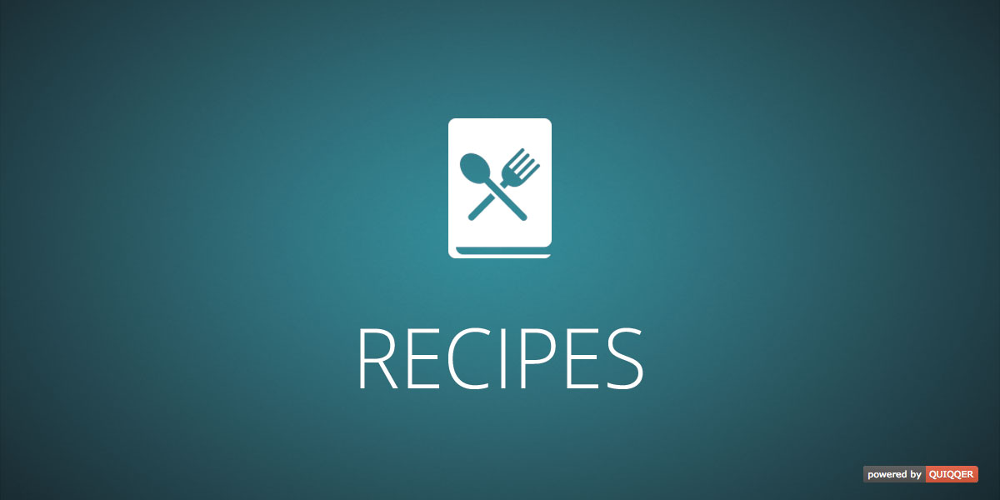

Recipes Plugin
==============

QUIQQER extension for managing your recipes.
After you have installed it, the sites panel of will be extended. Here you can add a new recipe.

Paketname:

    quiqqer/recipes

Features
--------

- Extends the blog entry and put new tab (recipe).
- Special fields for parts of your recipe (components, preparation time, etc).

Installation
------------

The package name is: quiqqer/recipes

Contribute
----------

- Project: https://dev.quiqqer.com/quiqqer/recipes
- Issue Tracker: https://dev.quiqqer.com/quiqqer/recipes/issues
- Source Code: https://dev.quiqqer.com/quiqqer/recipes/tree/master

Support
-------

If you have found a bug or want to make improvements,
then you can write an e-mail to support@pcsg.de.

License
-------

CC BY 3.0
